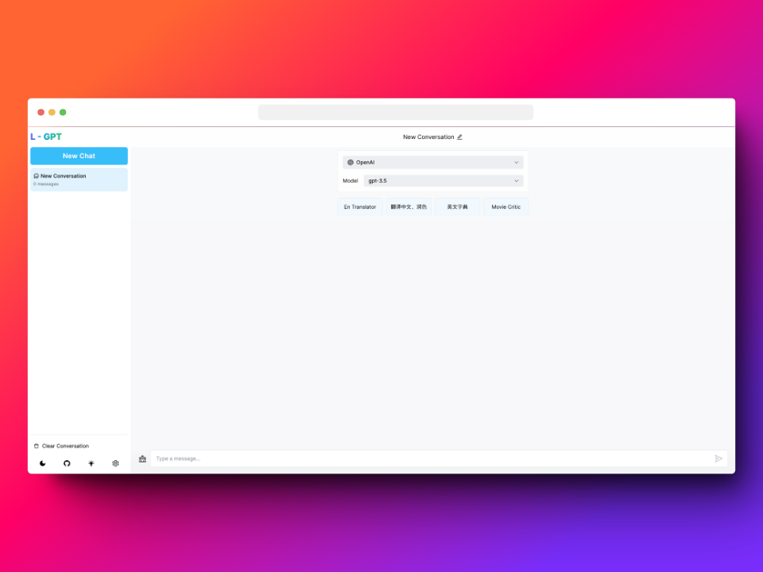
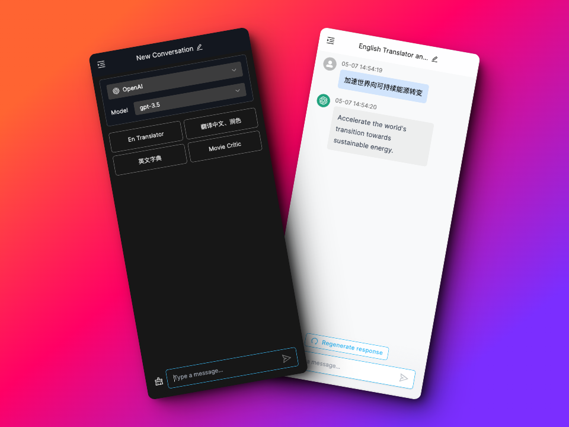

# L-GPT

English / [简体中文](./README_CN.md)

L-GPT is an open-source project that helps you improve your learning, work, and life efficiency by providing various AI models. [Demo](https://gpt.ltopx.com)

Welcome to：[Telegram](https://t.me/+7fLJJoGV_bJhYTk1)


## Preview





## Features

- Deploy for free on Vercel
- Responsive design and dark mode
- Safe, all data based on local
- Support i18n
- Support [Azure OpenAI Service](./azure.md)
- Support configuration and use of custom prompt

## Next

- [x] Support Azure OpenAI
- [x] Introduce prompt words and prompt word templates
- [x] Chat record import and export
- [x] Account System
- [x] Support conversation sharing
- [ ] Support for customizing the prompt repository
- [ ] Support GPT-4 and Claude
- [ ] Compress context to save chat tokens
- [ ] Desktop version development

## Deploy on Vercel

Get your own website.

```bash
# Configure Project

# Prefer using user-configured key.
# If user hasn't configured, then use this key.
# If neither are configured, it is not possible to use OpenAI API.
# eg: sk-xxxxxxxxxxxxxxxxxxxxxxxxxxxxxxxxxxxx
NEXT_PUBLIC_OPENAI_API_KEY=

# Prefer using user-configured proxy address.
# If the user hasn't configured, then use this proxy.
# If none of these are being used, then connect directly to the Open AI official address: https://api.openai.com.
NEXT_PUBLIC_OPENAI_API_PROXY=

# Set Your Azure OpenAI API key.
NEXT_PUBLIC_AZURE_OPENAI_API_KEY=

# Set Your Azure OpenAI API resource name.
NEXT_PUBLIC_AZURE_OPENAI_RESOURCE_NAME=

# Azure OpenAI Service API Version
NEXT_AZURE_OPENAI_API_VERSION=

# set your own sentry dsn. if empty here, it will not report error to sentry
NEXT_PUBLIC_SENTRY_DSN=


# DATABASE_URL
DATABASE_URL=

# NEXT-AUTH Email Configure. https://next-auth.js.org/providers/email
EMAIL_SERVER_HOST=
EMAIL_SERVER_PORT=
EMAIL_SERVER_USER=
EMAIL_SERVER_PASSWORD=
EMAIL_FROM=
EMAIL_SECRET=

# NEXT-AUTH Github Configure. https://next-auth.js.org/providers/github
GITHUB_ID=
GITHUB_SECRET=

# NEXT-AUTH Google Configure. https://next-auth.js.org/providers/google
GOOGLE_CLIENT_ID=
GOOGLE_CLIENT_SECRET=
```

[](https://vercel.com/new/clone?repository-url=https://github.com/Peek-A-Booo/L-GPT&env=NEXT_PUBLIC_OPENAI_API_KEY&env=NEXT_PUBLIC_OPENAI_API_PROXY&env=NEXT_PUBLIC_AZURE_OPENAI_API_KEY&env=NEXT_PUBLIC_AZURE_OPENAI_RESOURCE_NAME&env=NEXT_AZURE_OPENAI_API_VERSION&env=NEXT_PUBLIC_SENTRY_DSN&env=DATABASE_URL&env=EMAIL_SERVER_HOST&env=EMAIL_SERVER_PORT&env=EMAIL_SERVER_USER&env=EMAIL_SERVER_PASSWORD&env=EMAIL_FROM&env=EMAIL_SECRET&env=GITHUB_ID&env=GITHUB_SECRET&env=GOOGLE_CLIENT_ID&env=GOOGLE_CLIENT_SECRET)

## Running Local

**1. Clone Repo**

```bash
git clone https://github.com/Peek-A-Booo/L-GPT.git
```

**2. PNPM**

If you are not install `pnpm`, you can install it by running the following command.

```bash
npm install pnpm -g
```

**3. Install Dependencies**

```bash
pnpm i
```

**4. Configure Environment Variables**

Renamed .env.local.demo to .env.local and configure it according to requirements.

**5. Run App**

```bash
pnpm dev
```

**6. Build App**

```bash
pnpm build && pnpm start
```

## Configuration

You can configure the following environment variables.

| Environment Variable                     | Desc                                                            | Required | Default                  |
| ---------------------------------------- | --------------------------------------------------------------- | -------- | ------------------------ |
| `NEXT_PUBLIC_OPENAI_API_KEY`             | your OpenAI API Key                                             | false    |                          |
| `NEXT_PUBLIC_OPENAI_API_PROXY`           | your OpenAI API proxy server                                    | false    | `https://api.openai.com` |
| `NEXT_PUBLIC_AZURE_OPENAI_API_KEY`       | your Azure OpenAI API Key. [View Example](./azure.md)           | false    |                          |
| `NEXT_PUBLIC_AZURE_OPENAI_RESOURCE_NAME` | your Azure OpenAI API resource name. [View Example](./azure.md) | false    |                          |
| `NEXT_AZURE_OPENAI_API_VERSION`          | your Azure OpenAI API Version. [View Example](./azure.md)       | true     | 2023-05-15               |
| `NEXT_PUBLIC_SENTRY_DSN`                 | your sentry dsn. If empty, it will not report error to sentry   | false    |                          |
| `DATABASE_URL`                           | postgresql database address                                     | true     |                          |
| `EMAIL_SERVER_HOST`                      | next-auth email server host                                     | true     |                          |
| `EMAIL_SERVER_PORT`                      | next-auth email server port                                     | true     |                          |
| `EMAIL_SERVER_USER`                      | next-auth email server user                                     | true     |                          |
| `EMAIL_SERVER_PASSWORD`                  | next-auth email server password                                 | true     |                          |
| `EMAIL_FROM`                             | next-auth email from                                            | false    |                          |
| `EMAIL_SECRET`                           | next-auth email secret                                          | true     |                          |
| `GITHUB_ID`                              | next-auth github id                                             | true     |                          |
| `GITHUB_SECRET`                          | next-auth github secret                                         | true     |                          |
| `GOOGLE_CLIENT_ID`                       | next-auth google client id                                      | true     |                          |
| `GOOGLE_CLIENT_SECRET`                   | next-auth google client secret                                  | true     |                          |

## Contact

Any questions, please feel free to join our Telegram group or contact us on [Twitter](https://twitter.com/peekbomb).
