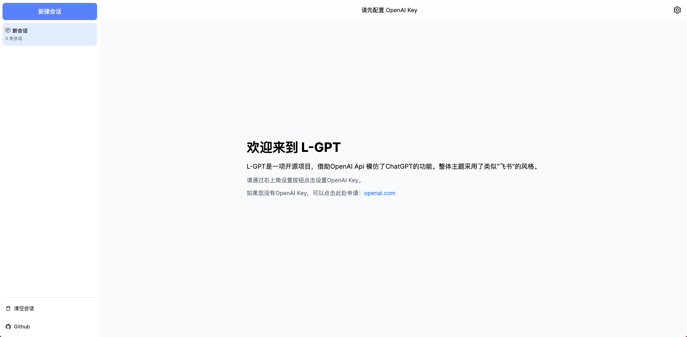

# L-GPT

L-GPT 是一项开源项目，借助 OpenAI Api 模仿了 ChatGPT 的功能。整体主题采用了类似\"飞书\"的风格。 [Demo](https://gpt.ltops.cn)



## 发布到 Vercel

搭建属于你自己的网站。

```bash
# Configure Project

# 如果设置了的话，它将被用作请求OpenAI API的默认身份验证信息。否则，需要在项目启动后进行配置。
# sk-xxxxxxxxxxxxxxxxxxxxxxxxxxxxxxxxxxxx
NEXT_PUBLIC_OPENAI_API_KEY=

# 默认为 https://api.openai.com，您可以将其设置为您自己的代理服务器。
NEXT_PUBLIC_OPENAI_API_PROXY=

# 配置你的 sentry dsn地址。如果为空, 将不会将错误报告到 sentry
NEXT_PUBLIC_SENTRY_DSN=
```

[](https://vercel.com/new/clone?repository-url=https://github.com/Peek-A-Booo/L-GPT&env=NEXT_PUBLIC_OPENAI_API_KEY&env=NEXT_PUBLIC_OPENAI_API_PROXY&env=NEXT_PUBLIC_SENTRY_DSN)

## 本地运行

**1. 克隆项目**

```bash
git clone https://github.com/Peek-A-Booo/L-GPT.git
```

**2. 安装 PNPM**

如果你之前没有安装或使用过`pnpm`，你可以通过运行以下命令来安装它。

```bash
npm install pnpm -g
```

**3. 安装依赖**

```bash
pnpm i
```

**4. 配置环境变量**

将 .evn.local.demo 重命名为 .env.local 并进行配置。

```bash
# sk-xxxxxxxxxxxxxxxxxxxxxxxxxxxxxxxxxxxx
NEXT_PUBLIC_OPENAI_API_KEY=
# 你个人的 api 代理地址。默认为 https://api.openai.com
NEXT_PUBLIC_OPENAI_API_PROXY=
# 配置你的 sentry dsn地址。如果为空, 将不会将错误报告到 sentry
NEXT_PUBLIC_SENTRY_DSN=
```

**5. 运行项目**

```bash
pnpm dev
```

**6. 打包项目**

```bash
pnpm build && pnpm start
```

## 配置项

你可以配置以下环境变量。

| 环境变量                       | 描述                                                      | 是否必须配置 | 默认值                   |
| ------------------------------ | --------------------------------------------------------- | ------------ | ------------------------ |
| `NEXT_PUBLIC_OPENAI_API_KEY`   | 设置之后将会充当你默认的 api key                          | 否           |                          |
| `NEXT_PUBLIC_OPENAI_API_PROXY` | 你个人的 api 代理地址                                     | 否           | `https://api.openai.com` |
| `NEXT_PUBLIC_SENTRY_DSN`       | 你的 sentry dsn 地址。如果为空, 将不会将错误报告到 sentry | 否           |                          |
